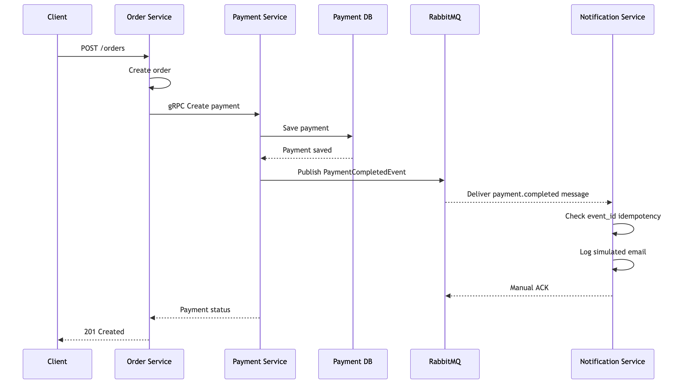
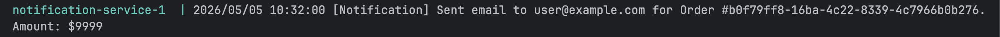

# Assignment 2 — gRPC Migration & Contract-First Development

## Overview
This project consists of two independent microservices: **Order Service** and **Payment Service**.

The main goal is to migrate internal communication from REST to **gRPC** and implement a **Contract-First approach** using Protocol Buffers.

---

## Repositories
- Proto Repository: https://github.com/zhettick/order-payment-protos.git
- Generated Code Repository: https://github.com/zhettick/order-payment-gen.git

---

## Architecture Overview

### Architecture Diagram


### Service Decomposition

#### Order Service
- Handles order lifecycle:
    - create order
    - get order
    - cancel order
    - get recent orders
- Exposes REST API (Gin)
- Acts as gRPC client (calls Payment Service)
- Acts as gRPC server (streams order updates)

#### Payment Service
- Processes payments
- Applies business rules
- Exposes gRPC server
- Includes logging interceptor

---

## Bounded Contexts

### Order Context
- order creation
- status management
- streaming updates

### Payment Context
- payment processing
- validation logic

Each service:
- has its own database
- contains its own business logic
- does not share internal code

---

## Clean Architecture

Each service follows layered architecture:

1. **Domain**
    - entities
    - repository interfaces

2. **Use Case**
    - business logic
    - validation rules

3. **Repository**
    - PostgreSQL implementation

4. **Transport**
    - HTTP (Order Service only)
    - gRPC (internal communication)
    - gRPC streaming

5. **Migrations**
    - SQL schema

---

## Inter-Service Communication

1. Client sends `POST /orders`
2. Order Service creates order (`Pending`)
3. Order Service calls Payment Service via gRPC
4. Payment Service processes payment
5. Order status becomes:
    - `Paid` (authorized)
    - `Failed` (declined)

---

## Contract-First Development

- `.proto` files define:
    - services
    - messages
    - enums
- Generated code stored in separate repository
- Both services import generated code

---

## Streaming

### RPC
`SubscribeToOrderUpdates`

### Behavior
- client subscribes by order ID
- Order Service checks database state
- when order status changes → update is sent via stream

---

## Error Handling

- gRPC timeout: `2s`
- Uses:
    - `status`
    - `codes`

Examples:
- `codes.InvalidArgument`
- `codes.NotFound`
- `codes.Internal`

### Failure Scenario
- Payment unavailable → HTTP `503`
- Order marked as `Failed`

---

## Additional Features

### gRPC Interceptor
Payment Service logs:
- method name
- execution time
- errors

---

## How to Run

### Docker
```
docker compose up --build
```

---

### Manual Run

#### Payment Service
```
cd payment
go run cmd/payment/main.go
```

#### Order Service
```
cd order
go run cmd/order/main.go
```

---

## Testing

### Create Order
```
POST http://localhost:8080/orders
```

```json
{
  "customer_id": "user_123",
  "item_name": "Laptop",
  "amount": 50000
}
```

---

### Failed Payment
```json
{
  "customer_id": "user_123",
  "item_name": "Car",
  "amount": 150000
}
```

---

### Get Order
```
GET /orders/{id}
```

---

### Cancel Order
```
PATCH /orders/{id}/cancel
```

---

### Streaming Test

```
evans --host localhost --port 50052 -r repl
package order.v1.service
service OrderService
call SubscribeToOrderUpdates
```
```sql
UPDATE orders SET status = 'Cancelled' WHERE id = '<order_id>';
```

---

### Event-Driven Notifications

```text
Order Service -> gRPC -> Payment Service -> RabbitMQ -> Notification Service
```


Payment Service is the producer. After a successful payment is saved, it publishes a `PaymentCompletedEvent` to RabbitMQ.

Notification Service is the consumer. It listens to the durable `payment.completed` queue and simulates sending an email by logging:
```text
[Notification] Sent email to user@example.com for Order #order-id. Amount: order-amount
```


---

#### Payment Service
- Works as RabbitMQ producer
- Publishes `PaymentCompletedEvent`
- Publishes only after payment is successfully saved
- Uses persistent messages
- Uses publisher confirms

#### Notification Service
- Works as RabbitMQ consumer
- Listens to `payment.completed` queue
- Does not call Order Service or Payment Service directly
- Uses manual ACK
- Implements idempotency using `event_id`

#### RabbitMQ
- Stores payment events
- Delivers events to Notification Service
- Keeps messages if Notification Service is offline

---

## Event Payload

The event is encoded as JSON.

```json
{
  "event_id": "uuid-value",
  "order_id": "order-id",
  "amount": 9999,
  "customer_email": "user@example.com",
  "status": "Authorized",
  "occurred_at": "2026-05-05T10:24:41Z"
}
```

---

## Idempotency

Each event has a unique `event_id`.

Notification Service stores processed event IDs in memory.

If the same message is delivered twice:

- the duplicate is detected
- the notification log is not printed again
- the message is ACKed

---

## How to Run

```bash
docker compose up --build
```

RabbitMQ UI:

```text
http://localhost:15672
guest / guest
```

---

## Testing

### Create Order

```http
POST http://localhost:8080/orders
```

```json
{
  "customer_id": "user_123",
  "item_name": "Phone",
  "customer_email": "user@example.com",
  "amount": 9999
}
```

Expected result:

```text
201 Created
```

Expected Notification Service log:

```text
[Notification] Sent email to user@example.com for Order #order-id. Amount: $9999
```

---

## Reliability Demo

Stop Notification Service:

```bash
docker compose stop notification-service
```

Create another order.

Check RabbitMQ queue:

```bash
docker compose exec rabbitmq rabbitmqctl list_queues name messages_ready messages_unacknowledged consumers
```

Expected result:

```text
payment.completed    1    0    0
```

Start Notification Service again:

```bash
docker compose start notification-service
```

The message is consumed, logged, and ACKed.

After successful processing:

```text
payment.completed    0    0    1
```

Check notification-service logs:

```bash
 docker compose logs notification-service           
```
