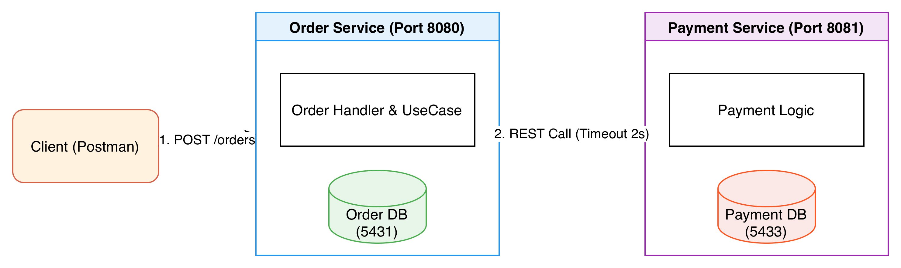
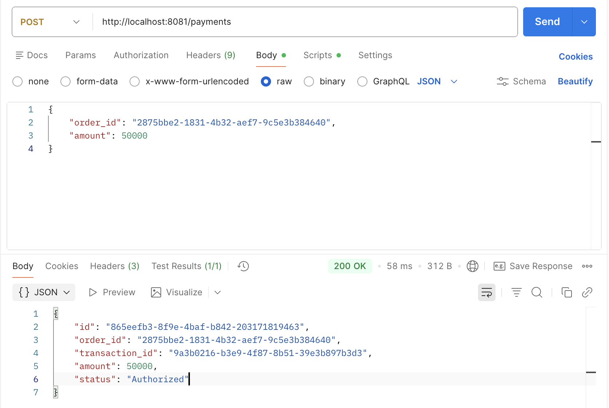
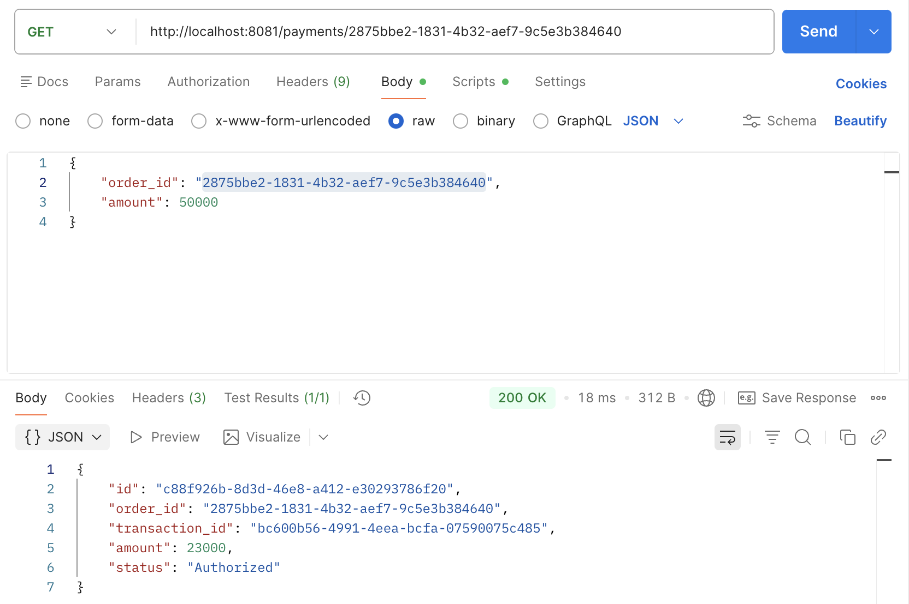

## Architecture Overview
The project consists of two independent microservices: **Order Service** and **Payment Service**. Both services are built following **Clean Architecture** principles to ensure separation of concerns and maintainability.

### Architecture Diagram


### Service Decomposition
- **Order Service:** Manages the lifecycle of customer orders. It creates orders and communicates with the Payment Service to process payments.
- **Payment Service:** Responsible for processing payments and validating transaction limits. It returns the result of payment authorization.

### Bounded Contexts
The system is divided into two independent bounded contexts:

- **Order Context:** handles order creation, retrieval, and cancellation
- **Payment Context:** handles payment authorization and validation

Each service owns its own domain, data, and logic. There is no direct database access between services.

### Clean Architecture Layers
Each service follows a layered architecture:
1.  **Domain (Entities):** Pure Go structures without any external dependencies (no JSON/DB tags).
2.  **Use Case:** Contains business logic
     - validating order amount
     - enforcing order status transitions
     - applying payment rules
3.  **Repository:** Responsible for data persistence using PostgreSQL.
4.  **Transport (HTTP):** 
    - parse requests
    - call use cases
    - return responses using DTOs
5.  **Migrations:** SQL scripts for database schema management.

### Inter-Service Communication
The Order Service communicates with the Payment Service using REST.
1.  Order is created with status **"Pending"**
2.  Order Service calls Payment Service
3.  Payment Service returns:
    - "Authorized" → Order becomes **"Paid"**
    - "Declined" → Order becomes **"Failed"**

### Resilience and Failure Handling
To ensure system stability:
- A custom HTTP client with a timeout (max 2 seconds) is used
- The system avoids blocking calls

Failure scenario:
- If Payment Service is unavailable:
    - Request times out
    - Order Service returns **503 Service Unavailable**
    - Order is marked as **"Failed"** (design choice)

### Architecture Decisions
1. **No Shared Code Between Services**  
   Prevents the "Distributed Monolith" problem. Each service owns its own models and logic.
2. **Database per Service**  
   Each service has its own database (or schema), ensuring loose coupling and fault isolation.
3. **Layered Architecture**  
   Clear separation of responsibilities improves maintainability and testability.
4. **Use of DTOs in HTTP Layer**  
   Prevents leakage of domain models and decouples internal logic from external API.
5. **Manual Dependency Injection (Composition Root)**  
   All dependencies are wired manually in `main.go`, following Clean Architecture principles.
---

## How to Run

### 1. Database Setup (Docker)
Ensure you have Docker installed and run:
```bash
docker-compose up -d
```
*This will start two PostgreSQL instances on ports 5431 and 5433.*

### 2. Run Services
Open two terminal tabs:

**Payment Service:**
```bash
cd payment
go run cmd/payment/main.go
```

**Order Service:**
```bash
cd order
go run cmd/order/main.go
```

---

## API Examples (Postman)

### Create Order (Success)
`POST http://localhost:8080/orders`
```json
{
    "customer_id": "user_123",
    "item_name": "Laptop",
    "amount": 50000
}
```


### Create Order (Fail - Over Limit)
`POST http://localhost:8080/orders`
```json
{
    "customer_id": "user_123",
    "item_name": "Car",
    "amount": 150000
}
```


### Get Order
`GET http://localhost:8080/orders/{id}`


### Cancel Order
`PATCH http://localhost:8080/orders/{id}/cancel`


### Create Payment
`POST http://localhost:8081/payments`
```json
{
    "order_id": "2875bbe2-1831-4b32-aef7-9c5e3b384640",
    "amount": 50000
}
```


### Get Payment
`GET http://localhost:8081/payments/{id}`

---

